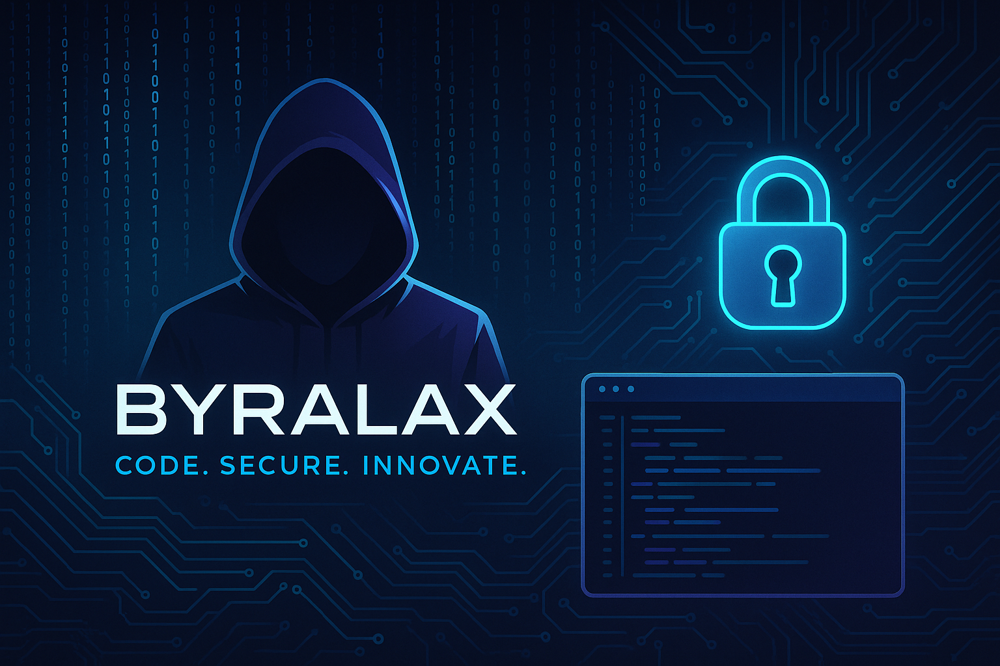

# Hi, I'm Byron 👋  
**a.k.a. Byralax** — *Code. Secure. Innovate.*

I'm a **Christian developer** and **cybersecurity explorer**, deeply rooted in code and purpose.  
I build software like I live: secure, clean, and driven by meaning.  
Whether it's spinning up REST APIs, dissecting malware, or crafting sleek UIs, I'm always chasing the next innovation with prayer, caffeine, and terminal tabs open wide.

---

## 🚀 About Me

- 🧠 CS student turned **network security analyst** with a hunger for real-world problems.  
- 🩺 Building impactful systems like **telehealth platforms** with smartwatch integration.  
- 💳 Created a **Bank Loan Management System** with a buttery front end and secured backend logic.  
- 🚦 Co-architected a ride-hailing app for university tricycles — *Uber, meet tuk-tuks*.  
- 📟 Mentoring folks into **cybersecurity**, starting from Linux basics to full-on red team energy.  
- 🔬 Tinkering with **Scapy**, **Burp Suite**, **Kali Linux**, and friends.  

---

## 🔧 Technologies & Tools

---

## 📚 Projects

### 🔬 [Telehealth EHR System with Smartwatch Integration](https://github.com/byralax/telehealth-platform)  
Real-time health data from smartwatches, securely transmitted to an EHR system for remote consultations and alerts.

### 🏦 [Bank Loan Management System](https://github.com/byralax/bank-loan-management)  
Track, manage, and visualize loan activity with a clean dashboard and strong backend logic.

### 🔐 [Cybersecurity Projects](https://github.com/byralax/cybersecurity-projects)  
- Network Scanner (Scapy, Python)  
- Web Vulnerability Scanner (JavaScript)  
- Malware Analysis Automation (Python)

### 💬 [Go Concurrency Chat App](https://github.com/byralax/go-chat-app)  
Simple, elegant concurrent chat with Go’s goroutines and channels.

### 🛺 [TrikeX: Uni Ride-Hailing Web App](https://github.com/byralax/trikeX) *(Hackathon Project)*  
Babcock University’s tuk-tuk transport made digital — real-time location sharing, email verification, and simple booking.

### 📦 [Pendora (Gift Box + Digital Message)](https://github.com/byralax/pendora)  
A creative project — custom paper box with a QR code linking to a digital birthday letter.

---

## 🧪 Experimental & Cool Stuff

- 🔥 Built **cyberpunk-style terminals** and futuristic Linux themes (Athena OS is my jam).  
- 🧠 Co-creating a **Python Crash Course for Cybersecurity** with a friend.  
- 🤖 Playing with AI tools and **discrete event simulation** for academic case studies.  
- 🌍 Blogging about **Linux, security, and dev life** with a raw, practical edge.  

---

## 📈 GitHub Stats

---

## 📞 Let's Connect

- 🐦 [Twitter](https://twitter.com/byralax)  
- 📧 [Email](mailto:byralax@gmail.com)  
- 🔗 [LinkedIn](https://linkedin.com/in/yourprofile) <!-- Replace with your actual LinkedIn link -->

---

**Open to collabs, convos, and cyber missions. Let’s build something awesome.**
